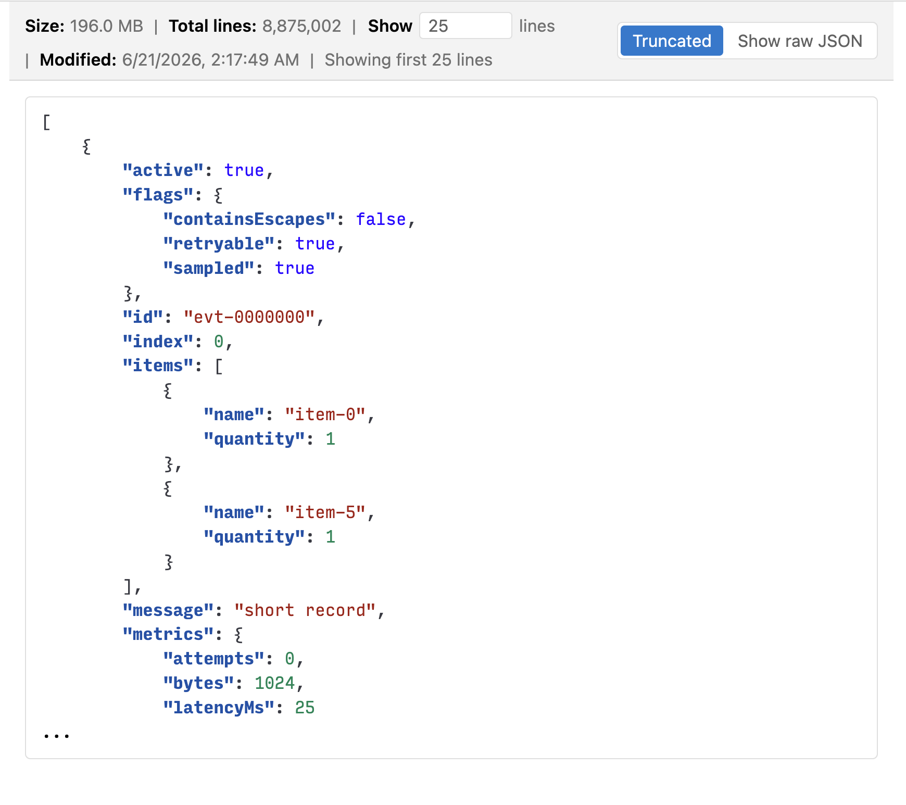

# Quick JSON Viewer

Quick JSON Viewer is a VS Code extension that opens big `.json` files in a
read-only, searchable custom editor designed to stay responsive with large JSON
documents.

You can also use it in IDEs that are based on VS Code, such as Cursor.

When you open a JSON file in Quick JSON Viewer and it is larger than the
configured threshold, the extension shows a syntax-highlighted raw-text preview
of the first configured number of lines. Files at or below the threshold open
with VS Code's default JSON editor.

## 1. Features

- Open large `.json` files in a read-only custom editor with a truncated raw-text preview.
- Automatically pretty-print minified JSON (1-line JSON).
- See useful file context, including file size, exact total line count, and last modified time.
- Search rendered preview text with VS Code's webview Find widget.
- Use `Show raw JSON` to disengage the extension and reopen the file with VS Code's default editor.

## 2. Screenshots

Read-only truncated JSON preview with syntax highlighting and file metadata:



## 3. Usage

Normal JSON file opens auto-route through Quick JSON Viewer when the file is
larger than `quickJsonViewer.largeFileThresholdMb`. Smaller files are handed off
to VS Code's default JSON editor. Source Control diffs stay in VS Code's normal
side-by-side text diff editor.

You can also run `Quick JSON Viewer: Open in Quick JSON Viewer` from the command
palette, the editor title menu, or the Explorer context menu for a `.json` file.

Use `Ctrl+F` on Windows/Linux or `Cmd+F` on macOS to search text in the rendered
preview contents.

## 4. Settings

- `quickJsonViewer.largeFileThresholdMb`: open files larger than this many MiB in Quick JSON Viewer. Default is `10`; minimum is `0`.
- `quickJsonViewer.previewLines`: number of lines to show for large JSON files. Default is `100`; minimum is `1`.
- `quickJsonViewer.maxAllowablePreviewLines`: safety limit for `quickJsonViewer.previewLines`. Default is `10,000`; use `-1` for no safety limit.
- The info bar `Show [input] lines` control updates `quickJsonViewer.previewLines` globally when you press Enter or leave the field.

To raise or disable the safety limit, update VS Code settings JSON:

```json
{
  "quickJsonViewer.maxAllowablePreviewLines": 20000
}
```

```json
{
  "quickJsonViewer.maxAllowablePreviewLines": -1
}
```

## 5. Truncated Preview

Quick JSON Viewer does not load or parse the whole JSON document. It checks the
file size, streams only the configured preview amount, and renders those
characters in a readonly webview. If more content remains, the preview shows
`...` on the next line.

For likely minified JSON, the preview is formatted while streaming until the
configured preview-line count is reached. The exact total line count still
reflects physical source-file lines.

Syntax highlighting is intentionally lightweight and presentation-only. It
highlights JSON-looking keys, strings, numbers, booleans, `null`, and
punctuation in the rendered preview, but it does not validate or reformat the
file.

The total line counter scans the file in the background and reports counting
progress in the info bar until the exact count is available.

Quick JSON Viewer does not force a global `*.json` editor association. The
extension auto-routes normal JSON editors over the size threshold, while JSON
diffs continue to use VS Code's normal side-by-side text diff.

## 6. Show Raw JSON

`Show raw JSON` opens the file in VS Code's default editor. The extension's top
info bar is not available there, but you can return to the viewer with
`Open in Quick JSON Viewer` from the editor title, Explorer context menu, or
command palette.

## 7. Notes for Developers

```sh
npm install
npm test
npm run format
```

`npm install` installs Husky hooks automatically. The pre-commit hook runs
`npm test`. Prettier formats the project with an 80-column print width, and
`npm test` checks formatting before compiling and running the test suite.

Use VS Code's extension host launch flow to test the viewer manually with the
small and large files in `sample-data/`.

The `Run Extension` launch configuration opens `sample-data/sample-data.json`
and `sample-data/large-placeholder.json` through the internal
`quickJsonViewer.openSampleFiles` command. These `.json` files are local-only
test fixtures and are ignored by Git. Generate the large file with:

```sh
python3 sample-data/generate_large_json.py
```

Create or copy a small `sample-data/sample-data.json` locally when using the
launch flow.
